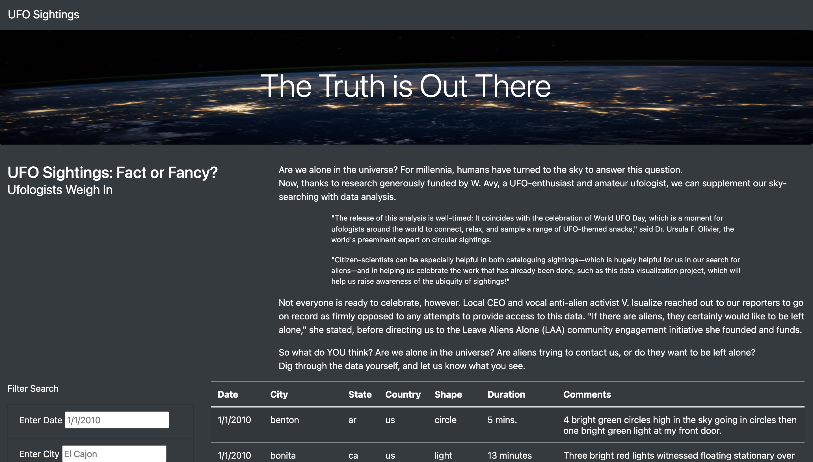
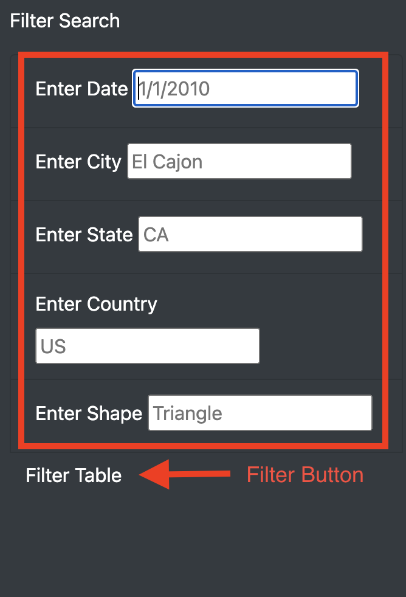

# UFOs

## Overview of Project
The purpose of this project is to provide a more in-depth analysis of UFO sightings by allowing users to filter for multiple criteria at the same time, specifically by date, city, state, country and shape of UFO.

## Results

The webpage can be filtered by utilizing the left hand filter. Please note that this filter is case-sensitive. You can enter just 1 filter or enter multiple to display more detailed information. Once the filter parameters have been sent the corresponding data will display.

## Summary
One drawback of this design is that it is case-sensitive which can affect search results if someone were to enter "CA" vs "ca". Removing this would allow an individual to search the data regardless of case sensitivity. Another recommendation to improve this design is to add code that allows us to scrape this data from the website it was obtained from to allow users to view real-time information. 